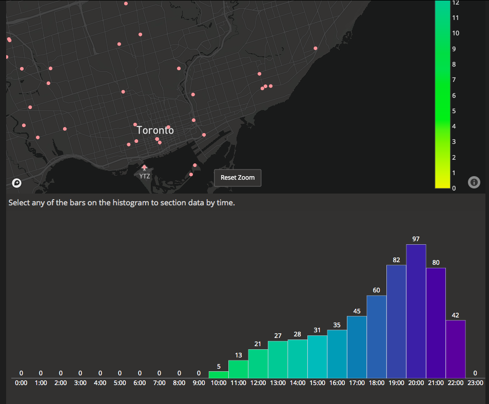

### COVID 19 Restaraunt Optimisation
*This is a work in progress project*

**Challenge:**
The restaraunts are not operating in the the same business environment as before owing to the epidemic. There will be no walk in customers anymore and delivery services like Uber Eats will be driving nearly all of the revenue. I jumped into this research assuming that it would help restaraunt chains but missed that in reality all the major restaruant chains are owned by seperate franchisees so there is little benefit of applying optimisation and prescriptive analytics.

The benefit would have included have reducing pressure on supply chain and recommendation on newer stores depending on spread of the virus in order to protect employees

## About this app

The app is built using [Plotly](https://plot.ly/) which allows to built great interactive visualisation and abstracts away languages such as Javascript, HTML & CSS.

## How to run this app

To run this app first clone repository and then open a terminal to the app folder.

```
git clone https://github.com/s3afroze/COVID-19-Restaraunt-Optimisation.git

cd COVID-19-Restaraunt-Optimisation/webapp
```

Install the requirements:

```
pip install -r requirements.txt
```
Run the app:

```
python app.py
```
You can run the app on your browser at http://127.0.0.1:8050


## Screenshots



